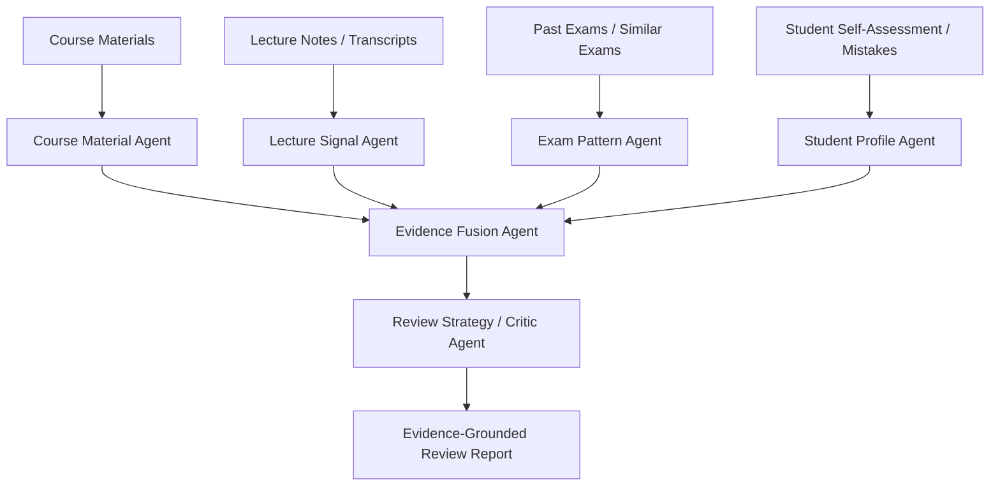

# CourseLens

CourseLens 是一个基于 n8n 的多智能体课程复习工作流原型。它面向“有大量课程资料、课堂重点、往年题和个人薄弱点，但需要可解释复习规划”的场景，通过多个专职 agent 分别抽取证据，再融合为带置信度和证据链的复习建议。

## 功能概览

CourseLens 采用 1 个总控工作流加 6 个子 agent：

1. **Course Material Agent**：从课程材料文本中生成知识地图。
2. **Lecture Signal Agent**：识别课堂强调、重复讲解、标注重点等信号。
3. **Exam Pattern Agent**：分析往年题或相似课程题目的题型与能力要求。
4. **Student Profile Agent**：整理学生自评、错题、薄弱点、目标和时间约束。
5. **Adaptive Evidence Fusion Agent**：融合多源证据，生成复习优先级和置信度。
6. **Review Strategy / Critic Agent**：生成复习计划，并审查是否存在无证据推断、过度押题或幻觉。
7. **CourseLens Orchestrator**：根据输入内容动态路由，调用上游 agent，串联证据融合和最终策略生成。



## 仓库结构

```text
.
├── CourseLens - 01 Course Material Agent.json
├── CourseLens - 02 Lecture Signal Agent.json
├── CourseLens - 03 Exam Pattern Agent.json
├── CourseLens - 04 Student Profile Agent.json
├── CourseLens - 05 Adaptive Evidence Fusion Agent.json
├── CourseLens - 06 Review Strategy Critic Agent.json
├── CourseLens - Orchestrator.json
├── CourseLens_project_overview.md
└── demo_inputs/
    ├── numerical_analysis_demo_input.json
    ├── numerical_analysis_exam_texts.json
    ├── numerical_analysis_highlights.json
    └── run_numerical_analysis_demo.ps1
```

## 环境要求

- n8n
- PowerShell，用于运行当前 demo 脚本
- 一个兼容 OpenAI Chat Completions 格式的 API
- 环境变量 `OPENAI_API_KEY`

工作流中的 HTTP Request 节点默认使用：

```text
Authorization: Bearer {{$env.OPENAI_API_KEY}}
```

如果你的 n8n 实例禁止节点读取环境变量，可以改用 n8n Credential，或在私有环境中临时填写密钥。不要把真实 API Key 提交到 GitHub。

## 快速开始

1. 启动 n8n。

2. 依次导入 6 个子 agent workflow JSON 和总控 workflow：

```text
CourseLens - 01 Course Material Agent.json
CourseLens - 02 Lecture Signal Agent.json
CourseLens - 03 Exam Pattern Agent.json
CourseLens - 04 Student Profile Agent.json
CourseLens - 05 Adaptive Evidence Fusion Agent.json
CourseLens - 06 Review Strategy Critic Agent.json
CourseLens - Orchestrator.json
```

3. 检查每个 workflow 的 webhook path 是否保持如下名称：

```text
course-material-agent
lecture-signal-agent
exam-pattern-agent
student-profile-agent
evidence-fusion-agent
review-strategy-critic-agent
courselens-orchestrator
```

4. 配置 API Key。

在运行 n8n 的环境中设置：

```powershell
$env:OPENAI_API_KEY = "your_api_key_here"
```

如果使用 Docker 或云端 n8n，请在对应部署环境里配置同名环境变量。

5. 激活所有 workflow。

6. 运行 demo：

```powershell
.\demo_inputs\run_numerical_analysis_demo.ps1
```

脚本会向本地总控 webhook 发送 `demo_inputs/numerical_analysis_demo_input.json`，并把结果写入：

```text
demo_inputs/numerical_analysis_demo_result.json
```

## 输入格式

总控 workflow 接收一个 JSON 请求。核心字段包括：

```json
{
  "agent_base_url": "http://localhost:5678/webhook",
  "course_id": "numerical_analysis_demo",
  "course_name": "数值分析",
  "student_id": "demo_student",
  "user_message": "我还有 2 天复习，每天 6 小时，希望根据课程材料、课堂重点和相似课程往年题制定复习计划。",
  "materials": [],
  "lectures": [],
  "past_exams": [],
  "questions": [],
  "student_inputs": [],
  "mistake_records": [],
  "time_constraints": {
    "days_left": 2,
    "hours_per_day": 6,
    "estimated_total_hours": 12
  },
  "strategy_options": {
    "planning_style": "time_boxed",
    "risk_tolerance": "conservative",
    "include_daily_plan": true,
    "include_checklist": true,
    "language": "zh"
  }
}
```

如果某类证据为空，总控 workflow 会跳过对应 agent，并在最终结果中保留证据覆盖情况和低置信度提示。

## 设计边界

CourseLens 强调 evidence-grounded review，而不是押题系统：

- 不预测真实考试题目。
- 不宣称某内容“必考”。
- 往年题和相似课程题目只能作为弱证据。
- 复习建议需要绑定来源、证据强度和置信度。
- 缺失证据时应显式标注不确定性。

## 后续计划

- 增加 PDF / PPT / 音频转写 ingestion workflow。
- 把 API endpoint、模型名和 header 抽象成更容易配置的变量。
- 增加 n8n 导入后的端到端测试说明。
- 添加更多课程 demo。
- 增加许可证、截图和示例输出。

## 免责声明

本项目用于课程复习辅助和多智能体工作流实验。输出内容仅作为学习规划参考，不应被用于考试作弊、押题宣传或替代教师课程要求。
